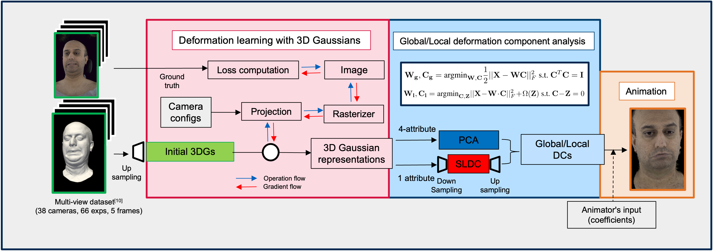

# Deformation Learning with structured 3D Gaussian for Intuitive Animation of Photorealistic Head Avatars

<p align="center">
Ryoto Kato, Tobias Kirschstein, and Matthias Nießner 
</p>

<p align="center">
Technical University of Munich
</p>

<p align="center">
    
</p>

We present the deformation learning of a photorealistic head avatar using structured 3D Gaussians for intuitive control and real-time realistic animation rendering. Our deformation learning can produce global deformation components that support rough fitting as a foundation for plausible facial expression and local deformation components that allow for more comprehensive facial expression modelling. Our local deformation components, in particular, solve discontinuity artefacts in animations by introducing our smooth sparsity assignment strategy.

## Acknowledgement
This project is done in my Practicum in WS2324 at TUM: [Visual Computing and AI Group](https://www.niessnerlab.org/index.html). I would like to thank [Tobias Kirschstein](https://tobias-kirschstein.github.io/) and Prof. Dr Matthias Nießner for such a great opportunity and for providing resources and support. I would also like to thank Meta for such a rich human face dataset and for making it open-source.

## Cite
Please kindly cite our repository if you find our software or algorithm useful for your research.

<section class="section" id="BibTeX">
  <div class="container is-max-desktop content">
    <h2 class="title">BibTeX</h2>
    <pre><code>@misc{ryotok2024IAC,
  title   = "IAC: Intuitive Animation Control",
  author  = {Kato, Ryoto and Kirschstein, Tobias and Nie{\ss}ner, Matthias},
  year    = "2024",
  month   = "Octorber",
  url     = "https://github.com/Ryoto-Kato/IntuitiveAnimationControl"
}</code></pre>
  </div>
</section>

# Pipeline overview


# Requirements
- Linux x86-64 (Debian is preferrable)
- python (conda)
- CUDA 11.8 / Driver Version: 550.54.15 (RTX3080)
- GPU 10GB VRAM (at least 8GB)
    - must fulfil requirements for 3D Gaussian splatting pipelines

# Setup
## set up conda env
```sh
conda create --name ica --file ica.yml
conda activate 3dsrf
# follow the 3DGS official installation TO INSTALL SUBMODULES
# place them into ./DeformationLearning_3DGS/submodules
```

#### Reference: an adaption of 3DGS to non-zero principle point offsets: [issue #144](https://github.com/graphdeco-inria/gaussian-splatting/issues/144#issuecomment-1938504456), officially apply to the official 3DGS implementation


## Multi-face dataset setup
### Download tracked meshes (66 expressions) and multi-views (38 cameras) of the target person (e.g., 6795937)
- Follow the guide to download them from [official-repo](https://github.com/facebookresearch/multiface).
### Convert data structure into the following by using `./src/tools/dataset_composer.py`
1. Make `dataset` at the same level as `3DSSL-WS23_IntuitiveAnimation` and create new folders (`multi_views`, `multiface`)
2. Clone the `tracked_mesh` and `meta_data` folders from downloaded multi-face data into the folder `multiface`
3. [TODO] Set `path_to_imageFolder` to the path to the image folder, which is downloaded from multi-face and set `ID` appropriately in `./src/tools/dataset_composer.py`,
    - e.g.,
        ```py
        ID = '6795937'
        path_to_imageFolder = "/path_to_multi-face/path_to_download_folder/m--20180227--0000--6795937--GHS/images"
        ```
4. Run `./src/tools/dataset_composer.py` 

### Final data structure
- from now, `path_to_dataset` = ./3DSSL-WS23-IntuitiveAnimation/dataset
```sh
├── 3DSSL-WS23_IntuitiveAnimation
    ├── src
    ├── dataset
        ├── multi_views
            ├──6795937
                ├── E001_Neutral_Eyes_Open
                    ├── 000102
                        ├── 000102.obj
                        ├── 000102.ply
                        ├── 000102_subd2.ply
                        ├── 000102_subd.ply
                        ├── 000102_transform.txt
                        ├── 400002.png
                        ├── 400004.png
                        ...
                    ├── 000108
                    ├── 000114
                    ...
        
        ├── multiface
            ├── tracked_mesh
                ├── E001_Neutral_Eyes_Open
                    ├── 000102.obj
                    ├── 00102_transform.txt
                    ...
                ├── E002...
            ├── meta_data
                ├── KRT
                ...

```
## Facemask generation
- We provide facemasks (.obj for visualization and .pkl for subsequent computation) in `./samples`, which are required for further computation
    - 3DGS `./samples/3dgs`
        - 87652 (after twice subdivision of multi-face tracked mesh): `FaceMask_sample_subd2_face_trimesh.obj`
        - 5509 (multi-face tracked mesh): `FaceMask_sample_face_trimesh.obj`
- You can generate a facemask by using `./samples` and `GetMask_mesh.ipynb`
- Visualization of a face mesh and its facemask can be done with `./src/tools/FaceMask_and_Mesh_visualizer.py`

## Deformation Learning with structured 3D Gaussians
### Setting up 3D Gaussian splatting pipeline by referring
1. Clone `gaussian-splatting` from the [official repo](https://github.com/graphdeco-inria/gaussian-splatting).
    - set up environment for original `gaussian-splatting`
        - additionally, `pip install pytranform3d`
    - [option] Clone `DeformationLearning_3DGS` from [repo](git@github.com:Ryoto-Kato/DeformationLearning_3DGS.git) or recursive clone of `3DSSL-WS23_IntuitiveAnimation`
    - Copy all source codes in `./DeformationLearning_3DGS` and paste them into the `gaussian_splatting` to use our customized Gaussian splatting codes

2. [TODO] Set constant appropriately as your environment
    ```py 
    # multiface_dataset_readers.py and original_train.py
    path_to_dataset = ...
    # original_train.py
    path_to_3WI = ...
    ID = "6795973"
    path_to_dataset = ...
    path_to_output = ...
    ```

### optimization of structured 3D Gaussians
```sh
# Activate the conda env
conda activate gaussian_splatting

python original_train.py #check options in the source code
tensorboad --logdir=path_to_output
```

## Deformation components analysis (global/local) 
### How to obtain the global/local deformation components given trained 3D Gaussians (.pkl)
1. Serialized trained 3D Gaussian properties in .pkl (use ./src/utils/pickel_io.py)
2. Convert the .pkl to Hierarchical data format (.hdf5)
    - Set the constant parameters
        ```py
        path_to_output =...
        session = ... # training session id
        ```
    - Use DeformatioLearning/3DGS_DC.ipynb
        - Input: `GaussianProp` data structure in .pkl
    
            ```py
            @dataclass
            class GaussianProp:
                xyz: np.ndarray 
                normals: np.ndarray
                f_dc: np.ndarray #this is SH_coeffs, needs to be converted to RGB by SH2RGB
                f_rest: np.ndarray
                opacities: np.ndarray
                scale: np.ndarray
                rotation: np.ndarray
                covariance: np.ndarray
            ```

        - Output: 
            
            ```sh
            # original trained 3D Gaussians
            /src/samples/deformation_components/trained_3dgs/<session_name>_87652.hdf5
            # after 1x downsampling (de-subdivision)
            /src/samples/deformation_components/trained_3dgs/<session_name>_21954.hdf5
            # after 2x downsampling (de-subdivision)
            /src/samples/deformation_components/trained_3dgs/<session_name>_5509.hdf5
            ```
       Contents 
        ```py
            # where the number of vertex = 87652
            xyz shape: (330, 262956) # 3D coordinate of centre of Gaussians 
            normals shape: (330, 262956) # Normal vectors at the centre of Gaussians
            rgbs shape: (330, 262956) # RGB obtained by converting the f_dc
            f_dc shape: (330, 262956) # 0-deg spherical harmonics (SH) lighting coefficients
            f_rest shape: (330, 3944340) # rest of the SH lighting coefficients
            opacities shape: (330, 87652) # opacities of Gaussians
            scales shape: (330, 262956) # scales of 3D Gaussians
            rotation shape: (330, 350608) # rotation of 3D Gaussians
        ```
3. Obtain deformation components for global effects (with PCA) and local effects (with SLDC) by using `src/tools/PCA_MBSPCA_3DGS.py`
    ### PCA on selected attributes `[xyz, f_dc, scale, rotation]`
    Apply PCA/MBSPCA on selected attributes of 3D Gaussians
    - input: `<session_name>_87652.hdf5`
    - output: `3dgs_87652_ALL_5perExp_trimesh_dcs.hdf5`
    
    
        - If we apply downsampling to trained 3D Gaussians in advance, you need to add `--upsampling` to store the standard deviation and average of the un-downsampled 3D Gaussians for later upsampling
       
    ```sh 
    # Where you are applying PCA and MBSPCA on the trained 3D Gaussians
    python PCA_MBSPCA_3DGS.py --path2folder="../samples/deformation_components/trained_3dgs" --hdf5_fname="<session_name>_87652.hdf5"
    # --selectedAttribs=['xyz', 'f_dc', 'scales', 'rotation'] (Default)
    ```

    ```sh
    # Where you are applying PCA and MBSPCA on the downsampled 3D Gaussians
    python PCA_MBSPCA_3DGS.py --path2folder="../samples/deformation_components/trained_3dgs" --hdf5_fname="<session_name>_5509.hdf5" --upsampling
    ```
    - [optional] You can get deformation components from MiniBatch sparse PCA using `scikit-learn`. However, there are better methods for local effects due to the inappropriate constraints in matrix factorization. Look at the details [here](https://scikit-learn.org/stable/modules/decomposition.html#sparsepca) 
    
    ### PCA on each attribute `[xyz, f_dc, scale, rotation]`
    **This step is required for the subsequent SLDC step**
    - input:`<session_name>_87652.hdf5`
    - output:`3dgs_87652_[xyz]_PCAMBSPCA_5perExp_trimesh_dcs.hdf5`
        - We will apply PCA on the data matrix, which concatenates the 3D Gaussian representation of each face with the centre of Gaussian `xyz` 

    ```sh
    python PCA_MBSPCA_3DGS_separateAttribs.py --hdf5_fname="f336a291-bnotALLcam_datamat_87652.hdf5"
    ```

    ### SLDC on single attribute `[xyz]`
    - input: `3dgs_87652_xyz_PCAMBSPCA_5perExp_trimesh_dcs.hdf5` (from **PCA on single attribute**)
    - output:
        - `gauss_3dgs_87652_xyz_SLDC_5perExp_trimesh_dcs.hdf5` (with `--gauss`) 
            - otherwise `3dgs_87652_xyz_SLDC_5perExp_trimesh_dcs.hdf5`
        - To make sure that you apply PCA/SLDC on the same data, we used the output .hdf5 from the previous step and applied SLDC on the data matrix from `3dgs_87652_PCAMBSPCA_5perExp_trimesh_dcs.hdf5`
    ```sh 
    python SLDC_trained3dgs.py --path2folder="../samples/deformation_components/trained_3dgs" --hdf5_fname="3dgs_87652_xyz_PCAMBSPCA_5perExp_trimesh_dcs.hdf5" --gauss # without --gauss runs original SLDC
    ```

[optional] upsampling process
- input: `3dgs_5509_ALL_5perExp_trimesh_dcs.hdf5` or `3dgs_21954_ALL_5perExp_trimesh_dcs.hdf5`
- output: `upsampled_3dgs_5509_ALL_5perExp_trimesh_dcs.hdf5` or `upsampled_3dgs_21954_ALL_5perExp_trimesh_dcs.hdf5`
    - upsampling the number of Gaussians and their attributes


```sh
python upsampling_DCs.py --numGauss=21954
```

## Animation
```sh
# Activate the conda env
conda activate gaussian_splatting

# Global deformation components
python original_render.py --path_to_hdf5="./output/f336a291-bnotALLcam/3dgs_87652_ALL_5perExp_trimesh_dcs.hdf5" --path_to_saveIMG=./output/f336a291-bnotALLcam/blendshape_result --dc_type=pca

# Local deformation components 
python original_render.py --path_to_hdf5="./output/f336a291-bnotALLcam/gauss_3dgs_87652_xyz_SLDC_5perExp_trimesh_dcs" --path_to_saveIMG=./output/f336a291-bnotALLcam/blendshape_result --dc_type=sldc
```

## Evaluation
- Comparison between 4 methods
    - **Ours (global)**: 3dgs_87652_ALL_5perExp_trimesh_dcs.hdf5
    - **COG-PCA**: 3dgs_87652_xyz_PCAMBSPCA_5perExp_trimesh_dcs.hdf5
    - **Ours (local)**: gauss_3dgs_87652_xyz_SLDC_5perExp_trimesh_dcs.hdf5
    - **T-SLDC**: 3dgs_87652_xyz_SLDC_5perExp_trimesh_dcs.hdf5
```sh
# Activate the conda env
conda activate 3dsrf
# Run evaluation and visualization of the deformation region 
python evalutation_DCs.py
```
